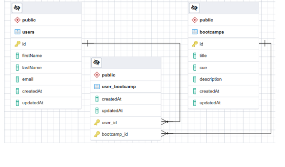
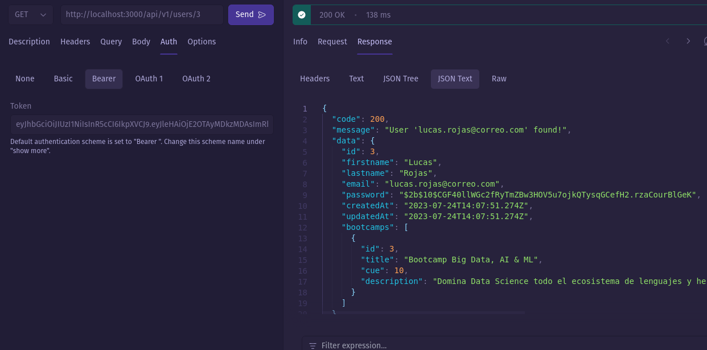
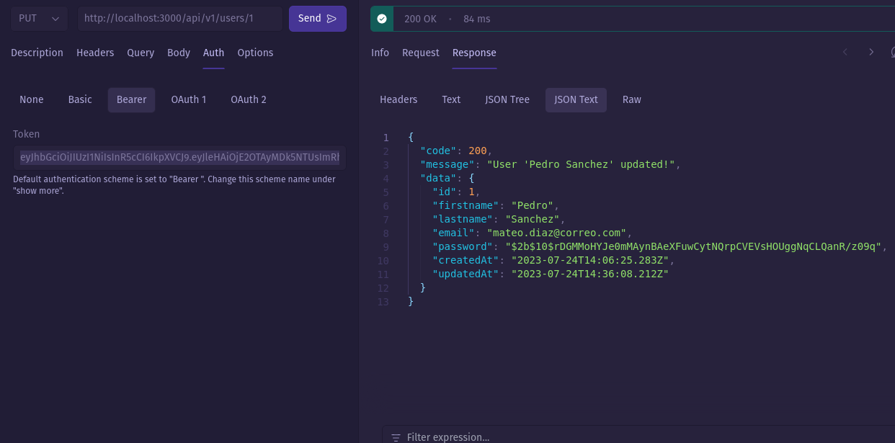
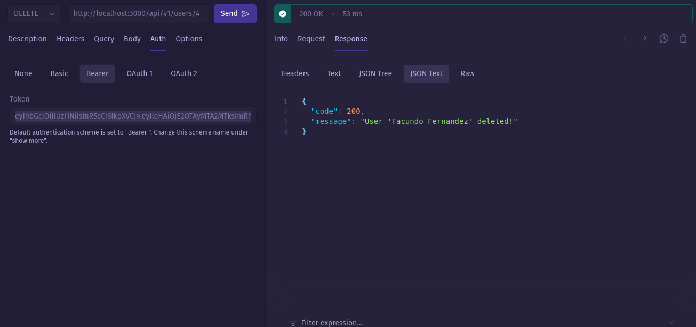
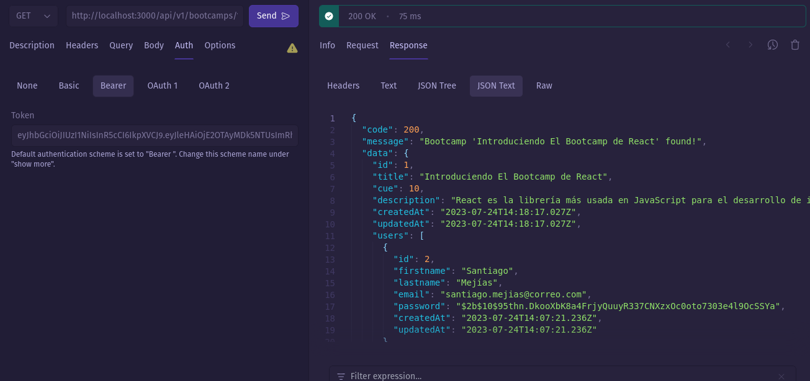
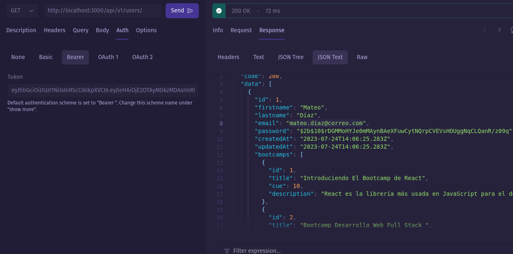
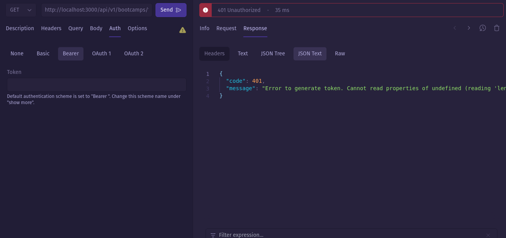

# CURSOS BOOTCAMP

Dado el siguiente modelo relacional:



Realizar las siguientes consultas:

* Listar el usuario con el id 3 
```bash
# GET
http://localhost:3000/api/v1/users/3
```

* Actualizar el usuario según su id; por ejemplo: actualizar el usuario con id=1 por Pedro Sánchez. 
```bash
# PUT
http://localhost:3000/api/v1/users/1
```
```json
{
  "firstname": "Pedro",
	"lastname": "Sánchez",
	"email": "mateo.diaz@correo.com"
}
```

* Eliminar un usuario por id; por ejemplo: el usuario con `id=3`. 
```bash
# DELETE
http://localhost:3000/api/v1/users/1
```

* Consultando el bootcamp por id, incluyendo los usuarios registrados 
```bash
# GET
http://localhost:3000/api/v1/bootcamps/1

```

* Listar todos los bootcamp con sus usuarios 
```bash
# GET
http://localhost:3000/api/v1/bootcamps

```

* Consultar un usuario por id incluyendo los bootcamp 
```bash
# GET
http://localhost:3000/api/v1/users/3
```

* Gestione adecuadamente el manejo de errores 